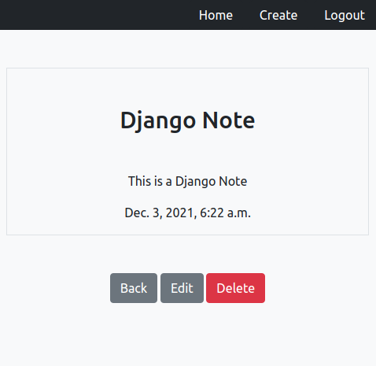

Notes App
-----

## Introduction
Notes App is a web application that allows the user to read, add, update, and delete notes in a SQLite database



## Dependencies
### 1. Backend Dependencies
The backend of the project includes:
* **virtualenv** as a tool to create isolated an Python environment
* **SQLite** as our database of choice
* **Python 3** and **Django** as our server language and server framework

You can download and install the dependencies mentioned above using these `pipenv`:

```
pip3 install django
```
### 2. Frontend Dependencies
We use HTML, CSS, and Bootstrap for our front end


## Main Files: Project Structure
  ```sh
  ├── README.md 
  ├── home 
  │   ├── admin.py
  │   ├── apps.py
  │   ├── models.py
  │   ├── tests.py
  │   ├── urls.py
  │   └── views.py
  ├── notes 
  │   ├── admin.py
  │   ├── apps.py  
  │   ├── forms.py
  │   ├── models.py
  │   ├── management 
  │   ├── templates
  │   ├── tests 
  │   ├── urls.py
  │   └── views.py
  ├── smartnotes 
  │   ├── settings.py
  │   ├── urls.py
  │   └── wsgi.py
  |
  └── static 
      ├── css
      └── templates
```

## Development Setup
```
git clone https://github.com/rawda-developer/Book-selllance
cd Book-sellance
```
**Add and Activate virtual environment:**
``` virtualenv venv
    source venv/bin/activate
```
**Run the development server:**
```
    ./manage.py makemigrations
    ./manage.py migrate
    ./manage.py createsuperuser
    ./manage.py test
    ./manage.py runserver
```
**Verify on the Browser**<br>
Navigate to project homepage [http://127.0.0.1:8000/](http://127.0.0.1:8000/) or [http://localhost:8000](http://localhost:8000) 